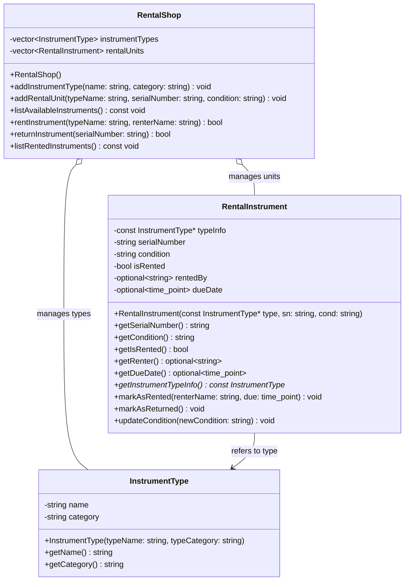

# Music Instrument Rental Program

## 1. Program Specification

This program manages a music instrument rental service. It allows tracking of different types of instruments (e.g., Violin, Trumpet) and the specific physical units available for rent. The core functionality includes listing all instruments and their availability, renting a specific instrument unit to a customer, and tracking when instruments are returned. The main entities involved are the instrument types, the individual rental units, the customers (renters), and the rental system managing the inventory and transactions.

## 2. Nouns and Verbs

**Nouns:**

* Program / System / Rental Shop
* Instrument Type / Instrument
* Rental Unit / Unit (of an instrument)
* Customer / Renter
* List (of instruments)
* Due Date
* Serial Number
* Condition

**Verbs:**

* Keep track / Track / Manage
* Have / List / See
* Rent / Check out
* Return

## 3. Class Design

*(Based on the Pet Tracker example format)*

```cpp
#include <string>
#include <vector>
#include <chrono> // For due dates potentially
#include <optional> // For optional renter info

// Forward declaration
class InstrumentType;

class RentalInstrument {
private:
    // Link to the general InstrumentType information
    const InstrumentType* typeInfo;
    std::string serialNumber; // Unique ID for this physical instrument
    std::string condition; // e.g., "New", "Good", "Fair"
    bool isRented;
    std::optional<std::string> rentedBy; // Renter name, simplified
    std::optional<std::chrono::system_clock::time_point> dueDate;

public:
    // Constructor requires linking to an InstrumentType
    RentalInstrument(const InstrumentType* type, const std::string& sn, const std::string& cond);

    // Getters
    std::string getSerialNumber() const;
    std::string getCondition() const;
    bool getIsRented() const;
    std::optional<std::string> getRenter() const;
    std::optional<std::chrono::system_clock::time_point> getDueDate() const;
    const InstrumentType* getInstrumentTypeInfo() const; // Access general type info

    // Actions (simplified - real implementation would be in RentalShop)
    void markAsRented(const std::string& renterName, std::chrono::system_clock::time_point due);
    void markAsReturned();
    void updateCondition(const std::string& newCondition);

};

class InstrumentType {
private:
    std::string name; // e.g., "Violin", "Trumpet"
    std::string category; // e.g., "String", "Brass", "Woodwind"
    // Other potential attributes: brand, rental price tiers etc.

public:
    InstrumentType(const std::string& typeName, const std::string& typeCategory);

    // Getters
    std::string getName() const;
    std::string getCategory() const;
    // Add other getters as needed (getBrand, etc.)
};

class RentalShop {
private:
    // Owns the collection of instrument types and their physical rental units
    std::vector<InstrumentType> instrumentTypes;
    std::vector<RentalInstrument> rentalUnits;

    // Helper method maybe
    // RentalInstrument* findAvailableUnit(const std::string& instrumentName);
    // RentalInstrument* findRentedUnit(const std::string& serialNumber);

public:
    RentalShop();

    // Add new instrument types and specific units to the inventory
    void addInstrumentType(const std::string& name, const std::string& category);
    void addRentalUnit(const std::string& typeName, const std::string& serialNumber, const std::string& condition); // Creates a unit linked to type

    // Core Functionality
    void listAvailableInstruments() const; // Shows types and available counts/units
    bool rentInstrument(const std::string& typeName, const std::string& renterName); // Finds available unit, marks rented
    bool returnInstrument(const std::string& serialNumber); // Finds unit by SN, marks returned

    void listRentedInstruments() const; // Shows who has what and when due
};
```

## 4. Mermaid Class Diagram

*(Based on the Pet Tracker example format)*


